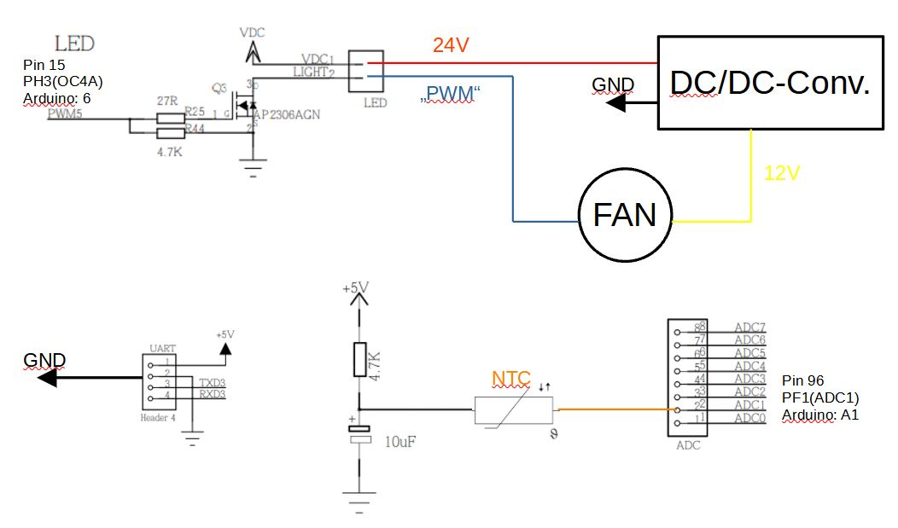
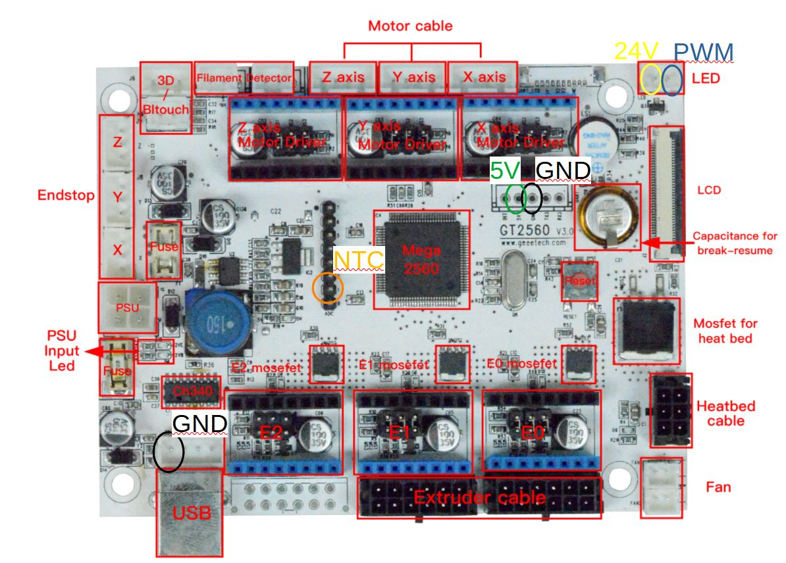
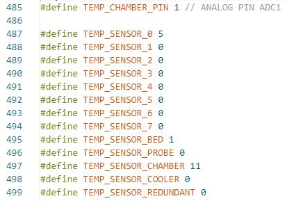
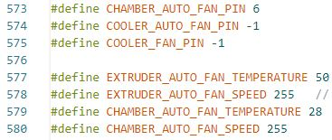

# How to upgrade Geeetech A10 with Exhaust Chamber Fan
I want to show here how to use a 12V fan for a chamber on the Geeetech A10 with a [GT2560 Board](https://github.com/Geeetech3D/Diagram/blob/master/GT2560_V3.0_SCH.pdf).

## How to do it:

 **_I am not responsible for your hardware or software. You do this at your own risk._**

### Requirements:

- 12V or 24V fan
- DC/DC Converter (24V to 12V e.g. LM2596S - only needed for 12V fan)
- 4.7k Ohm resistor
- 10uF capacitor (no exact match needed)

### Hardware:
1. Connect your DC/DC-Converter to a 24V power source and adjust the output to 12V

2. Wire everything like in this schematic:

  

It uses the LED-header of the board for a PWM-Signal. The normal FAN-header only provide constant 24V. The NTC is connected with the capacitor and the 4.7k Ohm Pull-up resistor to 5V. On the other side with the ADC1-header. It does not work with the ADC0 header for me. Some converters need a constant load at the output, so maybe it is necessary to add an extra resistor at the output.

  

(not in the picture: the right pin on the usb connector should also be 5V if needed.)

The hardware is done!

### Firmware:

Now it is time for the firmware. You need [Marlin 2](https://marlinfw.org/meta/download/) for this as far as I know.
I use [Arduino](https://www.arduino.cc/en/Main.Software) to edit and flash the firmware.

In Configuration.h:

- Change the NTC-Thermistor for the chamber (according to the one you used) `TEMP_SENSOR_CHAMBER` and define the ADC1 pin for it `TEMP_CHAMBER_PIN`.   

In Configuration_adv.h:
- Here you need to set the `CHAMBER_AUTO_FAN_PIN` to 6 (usually used for LED) and you can change the temperatures and fan speed.

Now it is time to flash the firmware and that is all.

You can find my current Marlin configuration [here](https://github.com/Jonas2903/Marlin-Geeetech-A10-TMC2209-UART-BLTouch).

Do not forget to enable chamber temperature in octoprint if you use it to see the temperature in the graphs.
